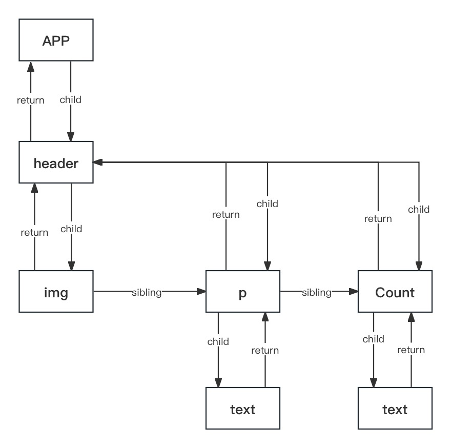

## 前言
在React开发中不可避免 我们总要用到`setState` 或者 `useState`相关以此来更新界面，但是在渲染中究竟发生了什么呢？让我们带着疑问一步一步看看。
## 前置
在React 中我们使用的是 `声明式渲染` ，我们 只需要声明与描述 就可以渲染出我们所需要的东西。声明式渲染是现代前端框架的比较普遍的设计思路。
而我们在编写类似 `HTML` 的语法编写组件时，通过`Babel`转成了浏览器能够识别的样子，在通过“加工”呈现在了用户面前。 `Babel` 把JSX编译成 `React.createElement` 的样子。
让我们看看一个例子。
```	js
const element = <h1 title="Word">Hello</h1>
```
转换以后得代码变成了
```	js
const element = {
  type: "h1", //标签类型
  props: { 
    title: "Word", //dom属性
    children: "Hello", //嵌套内容
  },
}
```
显而易见，我们从转变后可以看出他转变成了一个数据类型，这个数据类型包含渲染界面的一些数据。

在查看源码的时候我们可以看出 ReactElement 数据类型
```	js
var element = {
    // This tag allows us to uniquely identify this as a React Element 
    $$typeof: REACT_ELEMENT_TYPE,
    // Built-in properties that belong on the element
    type: type,
    key: key,
    ref: ref,
    _store:_store,
    props: props,
    source: source
    // Record the component responsible for creating this element.
    _owner: owner
    _self: _self
  };
```
#### 拓展
有的时候我们也会疑惑，如果简单一些讲解 是怎么生成UI界面的呢。我们简单的描描述一下。

``` js
import React from 'react';
import ReactDOM from 'react-dom';

const element = <h1 title="Word">Hello</h1>;
const container = document.getElementById("root");
ReactDOM.render(element, container);
```
转变成了
``` js
const element = {
  type: "h1", //标签类型
  props: { 
    title: "Word", //dom属性
    children: "Hello", //嵌套内容
  },
}

const container = document.getElementById("root")

const node = document.createElement(element.type)
node["title"] = element.props.title

const text = document.createTextNode("")
text["nodeValue"] = element.props.children

node.appendChild(text)
container.appendChild(node)
```
通过 `node.appendChild`实现了界面的渲染展示。当然这中间还有一些渲染时机和优化等等 这里并未体现。

## Fiber  
我们上面说到了`ReactElement` 结构，但是很明显我们没有办法从这个结构中知道更多关于组件的信息与状态，因此我们还需要更精细的结构。于是 `Fiber`出现了。让我们先粗略的看看 `FiberNode` 的结构。
```js
function FiberNode(tag, pendingProps, key, mode) {
  // Instance
  this.tag = tag;// 表示 Fiber 节点的类型（例如 FunctionComponent、HostComponent,ClassComponent）。
  this.key = key;// Fiber 节点的唯一标识符
  this.elementType = null;//
  this.type = null;// 用于存储组件的类型信息
  this.stateNode = null; // 指向与此 Fiber 节点关联的实际组件实例或 DOM 元素。

  this.return = null;// 父组件(关于这个名字为何叫return 有一篇文章专门阐述)
  this.child = null; // 子组件
  this.sibling = null; //  兄弟组件
  this.index = 0; // 在父节点的子节点列表中的索引。
  this.ref = null;  
  this.pendingProps = pendingProps; // 表示组件下一次渲染将接收的属性
  this.memoizedProps = null; // 最后一次提交的属性
  this.updateQueue = null;// 用于追踪组件的更新的数据结构
  this.memoizedState = null; // 最后一次提交的状态
  this.dependencies = null;// 在渲染过程中用于追踪依赖关系
  this.mode = mode; // 表示渲染模式（例如 Concurrent、Strict）

  this.flags = NoFlags; // 表示 Fiber 节点的各种状态和条件的标志。
  this.subtreeFlags = NoFlags;// 表示整个子树的状态标志。
  this.deletions = null;// 标记待删除的 Fiber 节点列表。
  this.lanes = NoLanes;
  this.childLanes = NoLanes;// 表示哪些更新被调度的标志。
  this.alternate = null; // 指向表示相同组件的先前 Fiber 节点（用于协调）。
  ...
}
```

`Fiber` 是在 React 16 被引入，我们之前经常提到的`VDOM`树在新的 React 架构下被称为 `Fiber` 树，上面提到的每个 `element` 都有一个所属的 `Fiber`。

在这里我们举一个例子说明一下
```jsx
// App.jsx    
    <div>
        <header>
            
            <p>
                text
            </p>

            <Count 
                count={count} 
                onCountClick={handleCLick} />
        </header>
    </div>
```
```jsx
// Count.jsx
    <div>
        {count}
    </div>

```
上面的代码形成的fiber树结构就类似于下图



react采取的遍历为深度优先遍历，可以粗鲁的认为遍历顺序为
``` js
child -> sibling -> parent
```

#### 拓展
##### tag
react 里是通过 tag 来区分 `fiber` 类型的，比如 `HostComponent` 就是元素，`FunctionComponent`、`ClassComponent` 就分别是函数组件和类组件。
##### mode
mode在创建时进行设置，在创建之后，mode在Fiber的整个生命周期内保持不变，可能的取值：
``` js
var NoContext = 0; // 同步模式
var ConcurrentMode = 1; // 异步模式
var StrictMode = 2; // 严格模式，一般用于开发中
var ProfileMode = 4; // 分析模式，一般用于开发中
```
##### effectTag
```js
// Don't change these two values. They're used by React Dev Tools.
// 一般作为effectTag的初始值，或者用于effectTag的比较判断，表示NoWork
var NoEffect = /*              */0;
// 由react devtools读取，NoEffect和PerformedWork都不会被committed，当创建effcet list（后面会介绍）时，会跳过NoEffect和PerformedWork
var PerformedWork = /*         */1;
// 向树中插入新的子节点，对应的状态为MOUNTING，当执行commitPlacement函数完成插入后，清除该标志位
// You can change the rest (and add more).
var Placement = /*             */2;
// 当props、state、context发生变化，或者forceUpdate时，会标记为Update，检查到标记后，执行commitUpdate函数进行属性更新，与其相关的生命周期函数为componentDidMount和componentDidUpdate
var Update = /*                */4;

var PlacementAndUpdate = /*    */6;
// 标记将要卸载的节点，检查到标记后，执行commitDeletion函数对组件进行卸载，在节点树中删除对应对节点，与其相关的生命周期函数为componentWillUnmount
var Deletion = /*              */8;
// 当从文本域节点切换到非文本域或空节点时，打上此标记，将文本内容进行重置，文本域节点包括textarea、option、noscript、string、number和直接在标签中写入的__html。当检测到标记后，执行commitResetTextContent函数将对应节点到text清空
var ContentReset = /*          */16;
// 当setState、forceUpdate有callback函数，或者在Commit阶段捕获到错误时，会更新update.callback，并标记Callback，随后检测到标记后会触发commitLifeCycles函数，根据不同到组件类型进行不同的commit
var Callback = /*              */32;
//  针对于懒加载的React.Suspense（SuspenseComponent）组件提供的标志位，DidCapture位置位表示要渲染的组件被挂起，进而先渲染fallback的内
var DidCapture = /*            */64;
// 当节点中存在属性ref时，会进行markRef当标记，随后会在commitAllLifeCycles阶段执行commitAttachRef触发相应当ref回调函数
var Ref = /*                   */128;
// 在渲染更新之前，当前后当props或state发生变化时，触发getSnapshotBeforeUpdate生命周期钩子
var Snapshot = /*              */256;
var Passive = /*               */512;

// Passive & Update & Callback & Ref & Snapshot
var LifecycleEffectMask = /*   */932;

// Union of all host effects
var HostEffectMask = /*        */1023;

var Incomplete = /*            */1024;
var ShouldCapture = /*         */2048;
```
每个`Fiber`都维护着一个`effectList`链表，一个fiber的effect list只包括他`children`的更新，不包括他本身，保存着`reconciliation`阶段的结果，每个`effectList`包括`nextEffect`、`firstEffect`、`lastEffect`三个指针，分别指向下一个待处理的effect fiber，第一个和最后一个待处理的effect fiber。react调用`completeUnitOfWork`沿`workInProgress`进行effect list的收集